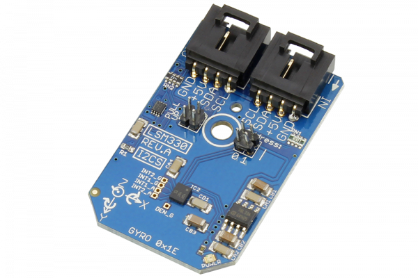

# LSM330

Manufactured by STMicroelectronics, the LSM330 is a system-in-package which features a 3D digital accelerometer with two embedded state machines which can be programmed to implement autonomous applications and a 3D digital gyroscope.The LSM330 has a user-selectable full-scale acceleration range of ±2/±4/±6/±8/±16g and an angular rate range of ±250/±500/±2000°/sec.
This Device is available from www.ncd.io 

[SKU: LSM330_I2CS]

(https://store.ncd.io/product/lsm330-inemo-inertial-module-3d-accelerometer-3d-gyroscope-i2c-mini-module/)
This Sample code can be used with Arduino.

Hardware needed to interface LSM330 sensor with Arduino

1. <a href="https://store.ncd.io/product/i2c-shield-for-arduino-nano/">Arduino Nano</a>

2. <a href="https://store.ncd.io/product/i2c-shield-for-arduino-micro-with-i2c-expansion-port/">Arduino Micro</a>

3. <a href="https://store.ncd.io/product/i2c-shield-for-arduino-uno/">Arduino uno</a>

4. <a href="https://store.ncd.io/product/dual-i2c-shield-for-arduino-due-with-modular-communications-interface/">Arduino Due</a>

5. <a href="https://store.ncd.io/product/lsm330-inemo-inertial-module-3d-accelerometer-3d-gyroscope-i2c-mini-module/">LSM330 iNEMO Inertial Module 3D Accelerometer Gyroscope Sensor</a>

6. <a href="https://store.ncd.io/product/i%C2%B2c-cable/">I2C Cable</a>

LSM330:

Manufactured by STMicroelectronics, the LSM330 is a system-in-package which features a 3D digital accelerometer with two embedded state machines which can be programmed to implement autonomous applications and a 3D digital gyroscope.The LSM330 has a user-selectable full-scale acceleration range of ±2/±4/±6/±8/±16g and an angular rate range of ±250/±500/±2000°/sec.

Applications:

• Motion activated functions

• 6D orientation detection

• Gaming 

• Virtual reality input devices.

How to Use the LSM330 Arduino Library

The LSM330 has a number of settings, which can be configured based on user requirements.
          
1.Accelometer data rate setting:The following command is used to set the data rate of accelometer.

            lsm.setAccelDataRate(ACCEL_DATARATE_3_125HZ);        // AODR (Hz): 3.125
            
2.Accelometer output range selection:The following command is used to select the output range of acceleration.

             lsm.setAccelRange(ACCEL_RANGE_16G);          // ±16 g
             
3.Gyroscope Data rate setting:The following command is used to set the data rate of gyroscope.             
             
             lsm.setGyroDataRate(GYRO_DATARATE_95_12_5);      // ODR (Hz): 95, Cutoff: 12.5
             
4.Gyroscope output range selection:The following command is used to select the output range of gyroscope.           
             
             lsm.setGyroScale(GYRO_SCALE_2000DPS);            // 2000 dps
